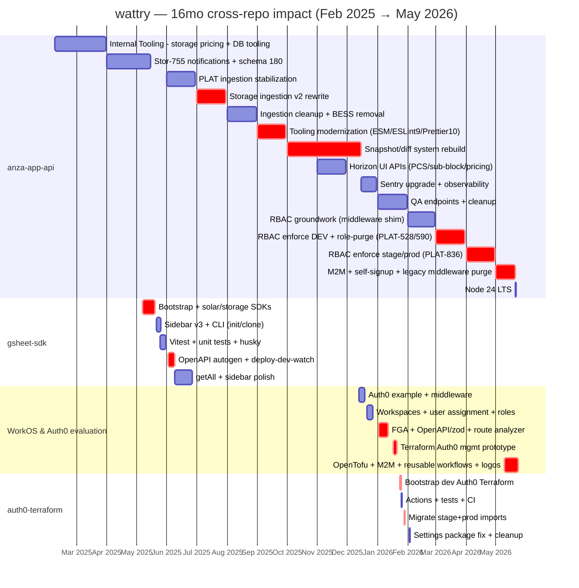

# wattry — 16-month cross-repo impact timeline

Generated 2026-05-26. Window: Feb 2025 → May 2026.

## Repo summary

| Repo | Commits | Window | Visibility | Role |
|---|---|---|---|---|
| **anza-app-api** | 327 | 2025-02-07 → 2026-05-21 | org | Platform feature work |
| **gsheet-sdk** | ~65 | 2025-05-07 → 2025-06-27 | org | Sole creator |
| **workos-demo** | ~64 | 2025-12-13 → 2026-05-24 | personal/private | R&D sandbox |
| **auth0-terraform** | ~32 | 2026-01-24 → 2026-02-02 | org | Sole creator |

Total ~488 commits, 4 repos.

## Themes by impact

| # | Theme | Repos | Window |
|---|---|---|---|
| 1 | RBAC + Auth0 consolidation pipeline (prototype → IaC → enforcement) | workos-demo → auth0-terraform → anza-app-api | Dec 2025 → May 2026 |
| 2 | Storage ingestion v2 rewrite | anza-app-api | Jul 2025 |
| 3 | Snapshot/diff system rebuild | anza-app-api | Oct → Dec 2025 |
| 4 | gsheet-sdk greenfield (SME tooling) | gsheet-sdk | May → Jun 2025 |
| 5 | Tooling modernization (ESM, ESLint 9, Sentry, Node 24) | anza-app-api | Sep 2025 → May 2026 |
| 6 | Horizon UI APIs (PCS, sub-block, pricing) | anza-app-api | Nov 2025 |
| 7 | Observability (Sentry upgrade, pino fixes) | anza-app-api | Dec 2025 |
| 8 | Storage notifications + schema 180 + ITT pricing fixes | anza-app-api | Feb–May 2025 |

## Per-repo detailed timeline

### anza-app-api (327 commits)

**Feb–Mar 2025** — Onboarding. ITT storage pricing fixes (ITT-597/670/681), PCS supplier mapping (ITT-645/657/658), tariff_percent (ITT-688), DB import/restore tooling.

**Apr–May 2025** — Stor-755 storage notifications endpoints, schema 180 migration, ITT-753 cleanup.

**Jun 2025** — PLAT-117/123/130/139/141/150/153 storage ingestion stabilization, transaction timeout fixes, OpenAPI fixes.

**Jul 2025 — Storage ingestion v2 (major rewrite)** — PLAT-170/177/182/191/192/205/216/217/222. Request-length refactor. Cell-by-cell DM. PCS DM construction. Storage schema + new fields.

**Aug 2025** — PLAT-237/241/247/249/253/258. is_platform_disabled, ingestion cleanup, BESS supplier removal, design_model truncation.

**Sep 2025 — Tooling modernization** — PLAT-98/146/226/247/265/294/296/305. ESLint v9 + Prettier v10 (PLAT-314). CommonJS→ESM. ramda → lodash-es (SF-125).

**Oct 2025 — Snapshot/diff system rebuild** — PLAT-274/317/327/331/336/351/352/371/372/375. Standardized snapshot/diff interface, daily job fix, pubsub await fix, product status enum.

**Nov 2025 — Horizon UI APIs** — PLAT-369/370/379. Sub-block + PCS selection endpoints. PCS pricing with region/target-power filters. PLAT-404 storage_blocks → storage_sub_blocks.is_active.

**Dec 2025** — PLAT-408/418/424/433/469. Sentry upgrade + API observability.

**Jan 2026** — PLAT-426/506. QA storage project creation. Curve cleanup.

**Feb 2026** — PLAT-568. Auth middleware shim (#3406/3407). User-permissions groundwork.

**Mar 2026 — RBAC rollout begins** — PLAT-528 remove role-based API decisions. PLAT-536 entitlements. PLAT-590 shadow → DEV enforcement. PLAT-612/648/679/736/737/738/762/765/770/773/775. Auth0 deprecation warning. Auth0 Mgmt API pagination.

**Apr 2026 — Auth0/RBAC heavy** — PLAT-722/776/781/784/785/807/823/836/838. Stage+prod role convergence. PLAT-836 shadow OFF on stage+prod. internal_solutions_engineer. internal_qa. JSON-driven roles. Disable user signups.

**May 2026 — Self-signup + legacy purge** — PLAT-850/854/865/866/867/869/870/883. M2M Auth0 client. Self-signup endpoints. Subscription table. PLAT-857/858/859/860/861/874/907 delete all legacy middleware + SHADOW_MODE branching. Node 24 LTS. Auto-regen Prisma + RBAC via git hooks.

### gsheet-sdk (~65 commits)

Repo bootstrapped 2025-05-07. VCS'd Google Sheets helpers + Apps Script SDK for product SMEs to call Anza services.

- **May 7** — Initial commit.
- **May 13** — Internal Tools first feature.
- **May 17** — Solar + storage SDKs.
- **May 19–20** — Linting, JS config, domain-restricted execution (@anzarenewables.com).
- **May 21–23** — Sidebar v3, close-on-error.
- **May 24–25** — init + clone CLI. README. Build scripts.
- **May 25–26** — Vitest workspace. Unit tests. Husky runs tests. scriptId header fix.
- **Jun 2** — **OpenAPI schema autogeneration**.
- **Jun 3** — oa-update command.
- **Jun 5** — deploy-dev-watch command.
- **Jun 9–12** — getAll methods, sidebar nav button layout, app selector, query→fragment.
- **Jun 17–27** — Sidebar button order/visibility, package bumps. Last commit.

Tie-in: Data Ingestion Pipeline (anza-app-api Jul 2025) "GSheet SME endpoints auth middleware failing" — gsheet-sdk in production use by SMEs by then.

### workos-demo (~64 commits, private)

Personal sandbox to eval WorkOS as Auth0 alternative + prototype Auth0 IaC + FGA.

- **Dec 13–19 2025** — Initial commit. Auth0 example. NextFunction middleware.
- **Dec 21–27** — Workspaces, user assignment, roles.
- **Jan 2–12 2026** — FGA + schemas. OpenAPI UI + zod-openapi. Static route analyzer. User-company relations. DB user→session. Lefthook.
- **Jan 17–21** — Terraform Auth0 management bootstrap. Resource breakdown. Host domain. User roles.
- **Jan 26** — ESLint config.
- **May 10–24** — Organize Terraform → **OpenTofu**. M2M clients + grants. Reusable workflows. GH workflows cleanup. Logos. Auth0 client comments.

Critical: **workos-demo Terraform Auth0 prototype (Jan 17–21) → auth0-terraform repo created Jan 24** (+3 days).

### auth0-terraform (~32 commits)

Bootstrapped 2026-01-24. Terraform-managed Auth0 across dev/stage/prod. Houses Actions (post-user-registration, add-user-to-roles) with tests.

- **Jan 24** — Initial commit, dev tenant + stage scaffold.
- **Jan 25** — Resource restructure. Tests for addRolesToUser + post-user-registration actions. Test docs.
- **Jan 26** — Terraform CI. README. PR-type CI. Linting.
- **Jan 28–29** — DEVOPS-647 main feature merge. Move prod resources. Imports + generated files for all envs.
- **Feb 2** — Settings package fix. Cleanup.

## Cross-repo dependencies

| workos-demo prototype | anza-app-api production |
|---|---|
| FGA config (Jan 2–10 2026) | RBAC entitlements (Mar 2026) |
| Terraform Auth0 mgmt (Jan 17 2026) | auth0-terraform repo (Jan 24 2026) |
| User-company relations + roles (Jan 19–21) | internal_solutions_engineer + role JSON (Apr 2026) |
| Static route analyzer (Jan 11) | adding-api-routes skill + validate-routes.ts |
| OpenAPI UI + zod-openapi (Jan 11) | OpenAPI autogen improvements |
| OpenTofu migration (May 10) | auth0-terraform follow-on |
| M2M clients + grants (May 16) | M2M auth middleware (May 6) |
| Auth0 client comments (May 23) | Docs cleanup (May 21) |

| auth0-terraform | anza-app-api ticket |
|---|---|
| Actions + env routing | Fix Auth0 action env routing |
| JSON-driven roles | Consolidate Auth0 roles |
| Canonical action+template files | Converge stage/prod |
| Terraform apply workflow | Re-add stage+prod to apply_auth0.yml |
| M2M client provisioning | M2M middleware |

## Patterns

- **Bootstrap-then-leverage**: solo-built tooling repos (gsheet-sdk, auth0-terraform), then exploited them in anza-app-api feature work months after.
- **Private-prototype playbook**: workos-demo = personal R&D lab. Auth0 IaC + FGA proven privately, then productionized in auth0-terraform + anza-app-api.
- **Quarter-scale initiatives**: RBAC + Auth0 consolidation = 5 months across 3 repos.
- **Burst → sustained**: short greenfield bursts (7wk, 10d) flank long sustained anza-app-api streams.

## Consolidated gantt

## TL;DR

16 months. 4 repos. ~488 commits. Two distinct dependency chains:

1. **Auth chain** (5 months, 3 repos): workos-demo Auth0 prototype → auth0-terraform IaC → anza-app-api RBAC enforcement + legacy purge.
2. **Storage chain** (6 months, 1 repo): ingestion v2 → snapshot/diff rebuild → Horizon UI APIs.

gsheet-sdk runs orthogonally — OpenAPI patterns reused in workos-demo Jan 2026.
